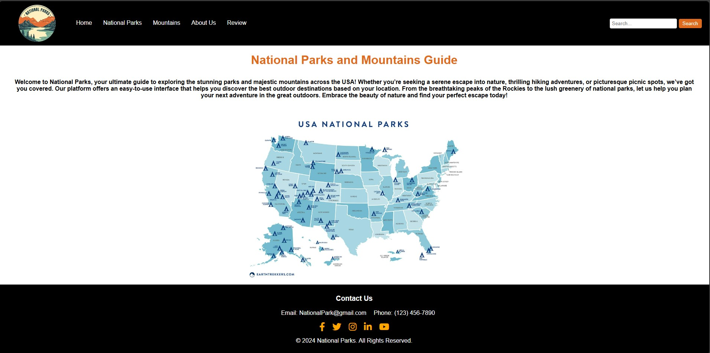
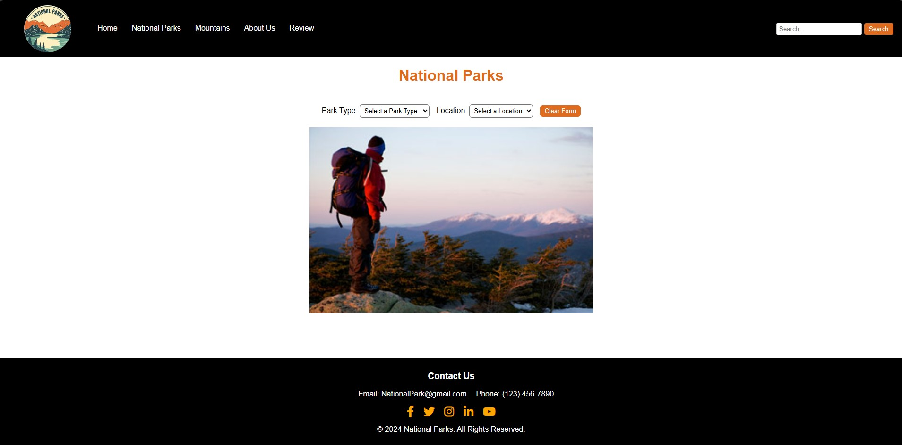
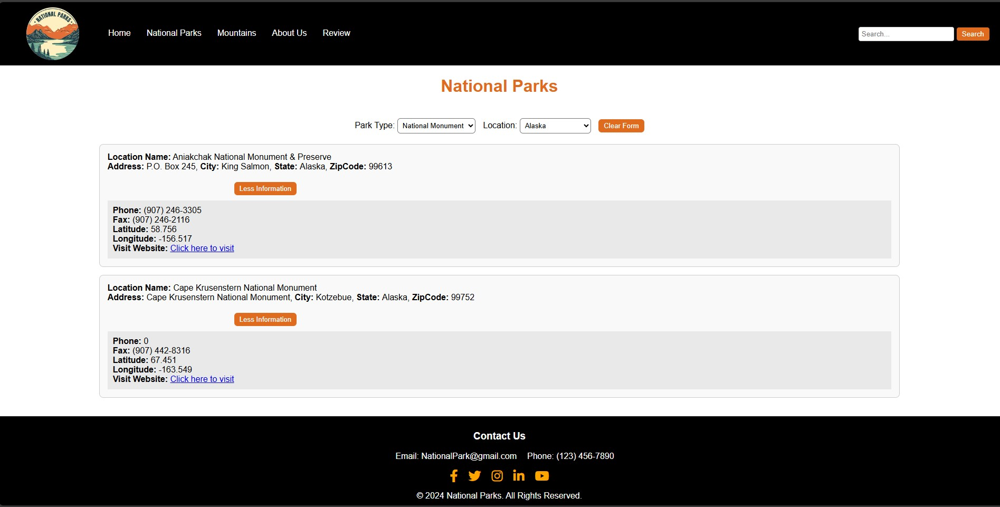
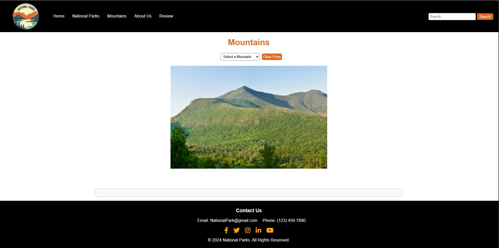
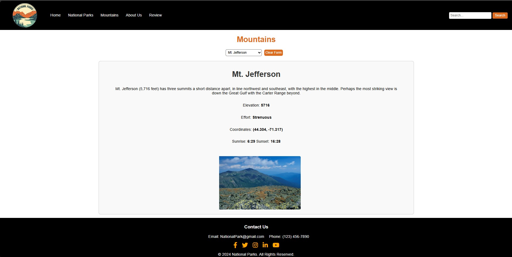
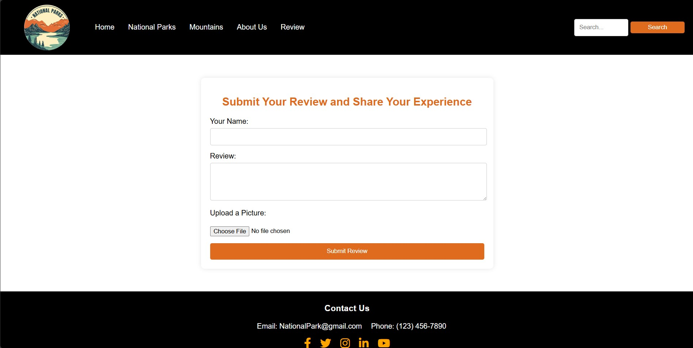

# National Parks and Mountains Guide

Welcome to the **National Parks and Mountains Guide**! This website helps you discover national parks and mountains across the country, based on your location, and type of park you're looking for.

## Features

- **Search Parks by Type**: Filter national parks based on their type (e.g., forest, desert, wetlands, etc.).
- **Search by Location**: Filter parks by state or region.
- **Park Details**: View essential park information such as location name, address, contact details, and more.
- **More Information**: Get extra details about each park, including contact info, latitude/longitude, phone, fax, and links to the park’s official page.
- **Slideshow**: Browse through stunning images of national parks and mountains in a slideshow.
- **Select Mountain**: View list of information and picture.
- **Upload Picture**: uploades a picture to share experience.

## Technologies Used

- **HTML5** - For the structure and content of the web pages.
- **CSS3** - For styling and layout of the website.
- **JavaScript** - For interactive features and dynamic content (e.g., search filters, slideshow).
- **GitHub** - For hosting the project repository.
- **W3C Validation** - To validate .HTML and .CSS

## Screenshots

### Homepage

Here’s a screenshot of the homepage: It contains a pharagraph about the company. It also has 10 diffrent images in a slideshow,



### NationalParksPage

When you first land on this page you will see an option to filter the result by location and park type. An slideshow is also displayed on this page.





### MountainPage

You will find a select option and a slideshow of the mountaines when you open this page. After selecting one option from the dropdown list of informations and an image will display.





### AboutUsPage

The companies mission and vision are displayed in this page with the team members.


### ReviewPage

On this page you can write a review and share your experience by uploading images.




## Getting Started

To get started, simply select from the diffrent pages provided in the nav bar. If you chose National Parks you can select the type of park or a specific location (state or region). The site will then display a list of parks that match your criteria. The second searching page is Mountain page once you select the a mountain type its shows you some information and an image of the moutain selected.

### Prerequisites

Make sure you have a modern web browser such as Chrome, Firefox, Safari, or Edge.

## How to Use the NationalParks page

1. **Select a Park Type**: Use the **Park Type** dropdown to choose the type of park you're interested in (e.g., mountains, forests, wetlands, etc.).
2. **Select a Location**: Use the **Location** dropdown to filter parks by state or region.
3. **View Results**: After selecting your preferences, the parks will be listed with detailed information.
4. **Explore Further**: Click on the **More Information** button to view additional details like contact info, phone number, fax, and latitude/longitude.
5. **Visit Official Park Websites**: If available, click on the **Visit Website** link to access official pages about the parks.

## Interesting Code: Dynamic Slideshow
```javascript
let slideIndex = 0;
const slides = document.getElementsByClassName("slides");

function showSlides() {
    for (let i = 0; i < slides.length; i++) {
        slides[i].style.display = "none";
    }
    slideIndex++;
    if (slideIndex >= slides.length) {
        slideIndex = 0;  // Loop back to the first slide
    }
    slides[slideIndex].style.display = "block";  // Show the current slide
    setTimeout(showSlides, 3000); // Change image every 3 seconds
}

document.addEventListener("DOMContentLoaded", function() {
    showSlides(); 
});

## License

This project is licensed under the MIT License - see the [LICENSE.md](LICENSE.md) file for details.

## Authors

- **Salem Hailemariam** - [YourGitHubProfile](https://github.com/Salem-H)

## Acknowledgements

- My instructor Kevin E Long for the support throuhout this project.
- **National Park Service** for providing open data on parks.
- **sunrise-sunset.org** used to fetch the sunset and sunrise time.
- **cdnjs.cloudflare.com** for the social media icons.
- **MDN Web Docs** for form/enctype to upload picture

## Contact

If you have any questions or suggestions, feel free to contact us me [salemkassal@gmail.com]